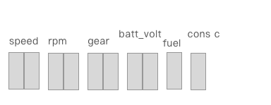
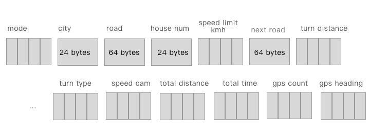

# KOSO Smart Speedometer Protocol

This project demonstrate how we are able to create an Android project to communicate with Koso RX5 device. We use bluetooth classic to communicate between Android and Rx5 (which is difference in iOS).


## Mobile Phone Notifications

| Mobile OS | Bluetooth         | Protocol                                                     |      |
| --------- | ----------------- | ------------------------------------------------------------ | ---- |
| Android   | Bluetooth classic | Audio Video Remote Control Profile(AVRCP) --> Android auto-handling<br />Hands-Free Profile (HFP)  --> Android auto-handling<br />Serial Port Profile (SPP)  --> <font color="red"> KOSO defined data</font> |      |
| iOS       | Bluetooth LE      | Apple Notification Center Service (ANCS) --> iOS auto-handling<br />Apple Media Service(AMS) --> iOS auto-handling<br />Generic Attribute Profile(GATT) --> <font color="red"> KOSO defined data</font> |      |
|           |                   |                                                              |      |

The KOSO smart speedometer integrates several Bluetooth protocols for data exchange with Android and iOS, including phone call messages, text messages, media playback messages, control, and other phone information exchange. It also uses Bluetooth SSP (Android) and BLE GATT (iOS) to exchange real-time data and navigation messages with the speedometer. Real-time messages from the phone are communicated with Android and iOS systems through AVRCP, HFP, AMS, ANCS protocols. Therefore, this document mainly introduces the KOSO custom content exchanged through Bluetooth SSP (Android) and BLE GATT (iOS), although the data format used is the same for both Android and iOS, transmitted through Bluetooth class and BLE, respectively.

## Communication flow

We uses 3 commands for RX5 communication, including:

- When connected with RX5, two commands will be received by App:
    - RuntimeInfo1Command (contains speed, rpm, battery voltage, fuel consumption, gear and fuel level data.)
    - RuntimeInfo2Command (contains odo, trip1, trip2 and some other statistics info.)
- App takes responsibility to calculate real-time navigation info and send to RX5
    - NaviInfoCommand (used to send road name, turn direction and distance info to RX5)

```mermaid
sequenceDiagram
    participant App
    participant RX5
    Note left of App: connect to RX5
    loop connected
    RX5->>App: RuntimeInfo1Command
    RX5->>App: RuntimeInfo2Command
    end
    Note left of App: start navigation
	loop navigating
	App->>RX5: NaviInfoCommand 
	end
	
```


## Payload format

The data playload follow the defined data structure


| Command        | BeginByte    | EndByte      |
| -------------- | ------------ | ------------ |
| Runtime Info 1 | [0xFF, 0x80] | [0xFF, 0x2B] |
| Runtime Info 2 | [0xFF, 0x81] | [0xFF, 0x2C] |
| Navi Info      | [0xFF, 0x89] | [0xFF, 0x33] |


### RuntimeInfo1Data

Send from RX5 to App once per second.
It contains runtime speed, rpm, battery voltage, fuel consumption, gear and fuel level data (please refer to the RuntimeInfo1Command data model below). App side will receive once per second automatically when app connected to RX5.



| Name                | Length  | Explain    |
| ------------------- | ------- | ---------- |
| Speed               | 2 bytes | Speed Km/h |
| Rpm                 | 2 bytes |            |
| Gear                | 2 bytes |            |
| Batt volt           | 2 bytes |            |
| Fuel                | 1 byte  | Percentage |
| Instant consumption | 1 byte  |            |


### RuntimeInfo 2 Data

Send from RX5 to App once per 10 seconds.
It contains odo, trip1, trip2 and some other statistics info (please refer to the RuntimeInfo2Command data model below). App side will receive once per 10 seconds automatically when app connected to RX5


| Item                       | Length  | Explain |
| -------------------------- | ------- | ------- |
| ODO                        | 4 bytes | Meter   |
| Total ODO                  | 4 bytes |         |
| Total ride time            | 4 bytes |         |
| Average speed              | 2 bytes |         |
| Average consumption        | 2 bytes |         |
| Trip 1 distance            | 4 bytes |         |
| Trip 1 time                | 4 bytes | Seconds |
| Trip 1 average speed       | 2 bytes |         |
| Trip 1 average consumption | 2 bytes |         |
| Trip 2 distance            | 4 bytes |         |
| Trip 2 time                | 4 bytes |         |
| Trip 2 average speed       | 2 bytes |         |
| Trip 2 average consumption | 2 bytes |         |
| Trip A distance            | 4 bytes |         |
| Total recording time       | 4 bytes |         |
| Fuel range                 | 4 bytes | KM      |
| Next Maintenance Distance  | 4 bytes | Meter   |


### NaviInfoCommand


Navigation info, Send from App to Rx5, at least one transaction per 10 seconds.

In the navigation function, App should take responsibility of calculating the navigation info, then send the direction result to the RX5 at every location updated. You are able to write a NaviInfoCommand using Rx5Handler.rx5!!.write() method.



| Name               | Length   | Explain                                                 |
| ------------------ | -------- | ------------------------------------------------------- |
| Mode               | 4 bytes  | Navigating = 1                                          |
| City               | 24 bytes | UTF-8 string                                            |
| Road               | 64 bytes | UTR-8 string                                            |
| House number       | 24 bytes | *Not implement*                                         |
| Speed limit        | 4 bytes  |                                                         |
| Next road          | 64 bytes |                                                         |
| Turn distance      | 4 bytes  |                                                         |
| Turn type          | 4 bytes  | Refer to [RX5 nextturn type] section below              |
| Speed camera alert | 4 bytes  | No alert = 0, Alert = 1, Alert > 1 (distance of camera) |
| Total distance     | 4 bytes  | Meter                                                   |
| Total time         | 4 bytes  | Minutes                                                 |
| Gps Count          | 4 bytes  | 0 - 12                                                  |
| Gps Heading        | 4 bytes  | Degree                                                  |


## Sample project 

- Clone git repository to local storage

    ```
    git clone https://github.com/koso-app/KosoRx5-Android.git
    ```

- Add core module into your project

    - Open your project
    - In the Android Studio, click File/New/import module and selects core module in the project just clone into "core" folder in the project

- In the settings.gradle, include "core" module

    ```
    include ':core'
    ```

- In the module level build.gradle, add "core" module as dependency

    ```
    dependencies {
        implementation project(path: ':core')
        ...
    }
    ```

    

## Connect to a RX5

To connect to a RX5, you are able to find the Mac address of the RX5 by [Find bluetooth devices](https://developer.android.com/guide/topics/connectivity/bluetooth/find-bluetooth-devices). Then you are able to connect to this RX5 via static method Rx5Handler.startConnectService(). Following are the sample code to connect to a RX5.

```kotlin
import com.koso.rx5.core.Rx5Handler

// connect to a RX5 device
Rx5Handler.startConnectService(
    context,
    targetMacAddress,
    100 //foreground service notification ID
)
```

Rx5Handler.startConnectService() will start a foreground service with a notification to make sure the connection will not terminate by Android.


## Interrupt a connection

You're able to disconnect programmatically by following snippets.

```kotlin
// to stop a connection to RX5
Rx5Handler.stopConnectService(requireActivity())
```


## Listen to connection state

Rx5Handler.STATE_LIVE is a [LiveData](https://developer.android.com/topic/libraries/architecture/livedata) observable object, provides runtime change of the Rx5Device.State which Including Disconnected, Discovering, Connected and Connecting

```kotlin
Rx5Handler.STATE_LIVE.observe(lifecycleOwner) {
    updateStateUi(it)
    if (it == Rx5Device.State.Connected) {
        //do something when connected to RX5
    } else if(it == Rx5Device.State.Disconnected){
        //do something when disconnected
    } else if(it == Rx5Device.State.Discovering){
        //do something when scanning device
    } else{
        //do something when connecting device
    }
}
```


## Listen to incoming commands

After connected to a RX5 device, you're able to subscribe the preodically incoming commands including Runtime-info1 (once per second) and Runtime-info2 (once per 10 seconds)

```kotlin
Rx5Handler.incomingCommandLive().observe(lifecyclerOwner){ it ->
    if(it is RuntimeInfo1Command){
        // do something about RuntimeInfo1Command
        val speed = it.speed
    } else if (it is RuntimeInfo2Command){
        // do something about RuntimeInfo2Command
        val odo = it.odo
    }
}
```


## Commands detail - Read from RX5

### Runtime-info 1 command

Send from RX5 to App once per second.
It contains runtime speed, rpm, battery voltage, fuel consumption, gear and fuel level data (please refer to the RuntimeInfo1Command data model below). App side will receive once per second automatically when app connected to RX5.

*RuntimeInfo1Command data model*

```kotlin
 class RuntimeInfo1Command{
     var speed: Int  //km/h
     var rpm: Int  // r/min
     var batt_vc: Int  // Battery voltage (by 0.1V)
     var consume: Int  // Fuel consumption L/H 
     var gear: Int  // instant gear
     var fuel: Int    // Fuel Level (bit0~6 , warming bit7)
     ...
 }
```


### Runtime-info 2 command

Send from RX5 to App once per 10 seconds.
It contains odo, trip1, trip2 and some other statistics info (please refer to the RuntimeInfo2Command data model below). App side will receive once per 10 seconds automatically when app connected to RX5

*RuntimeInfo2Command data model*

```kotlin
class RuntimeInfo2Command{
    var odo: Int // 32bit
    var odo_total: Int // 32bits
    var average_speed: Int //kmh, 32bits
    var rd_time: Int //Total ride sec, 16bit
    var average_consume: Int //平均油耗KM/L, 16 bits
    var trip_1: Int //trip1 meter, 32bits
    var trip_1_time: Int //trip1 time sec, 32bits
    var trip_1_average_speed: Int //16bits
    var trip_1_average_consume: Int //16bits

    var trip_2: Int //trip2 meter, 32bits
    var trip_2_time: Int //trip2 time sec, 32bits
    var trip_2_average_speed: Int //16bits
    var trip_2_average_consume: Int //16bits

    var trip_a: Int //trip auto meter, 32bits
    var al_time: Int //total time, 32bits
    var fuel_range: Int //km, 32bits
    var service_DST: Int //maintain alarm distance, 32bits
    ...
}
```


## Commands detail - Write to RX5

### Navigation info command

Navigation info, Send from App to Rx5, at least one transaction per 10 seconds.

In the navigation function, App should take responsibility of calculating the navigation info, then send the direction result to the RX5 at every location updated. You are able to write a NaviInfoCommand using Rx5Handler.rx5!!.write() method.

*Navigation info data model*

```kotlin
 class NaviInfoCommand{
     val navimode: Int,          //navimode  =0導航模式
     val ctname: String,      //char         ctname[24]; city name 
     val roadname: String,    //char         nowroadname[64];  //road name
     val doornum: String,     //char         doornum[24]; // house number
     val limitsp: Int,           //int          limitsp;  //limit speed of current street by km/h  
     val nextroadname: String,//char         nextroadname[64];  // next turn street name 
     val nextdist: Int,          //int          nextdist;  //next turn distance by meter   
     val nextturn: Int,          //int          nextturn; // next turn direction
     val camera: Int,            //int          camera; //speed camera alert :  0 for none, 1 exist one alert
     val navidist: Int,          //int          navidist; // total distance for navigation by meter        
     val navitime: Int,          //int          navitime; // total time for navigation by minutes   
     val gpsnum: Int,            //int          gpsnum; //GPS fixed count 
     val gpsdir: Int						// int gps heading
 }
```

To send a NaviInfoCommand to RX5

```kotlin
// create a NaviInfoCommand
val cmd = NaviInfoCommand(
    mode,
    cityname,
    roadname,
    doornum,
    limitsp,
    nextroad,
    nextdist,
    nextturn,
    camera,
    navidist,
    navitime,
    gpsnum,
    gpsdir
)

// Check if remote device available
if(Rx5Handler.rx5 != null) {
    // Write cmd to RX5
    val ok = Rx5Handler.rx5!!.write(cmd)
}else{
    // Failed, connection is not available
}
```


## RX5 nextturn type

RX5 turn type mapping to [Google direction API](https://developers.google.com/maps/documentation/directions/overview)'s Maneuver

| Google map maneuver | Turn type |                         Sample image                         |
| ------------------- | :-------: | :----------------------------------------------------------: |
| fork-left           |    36     |  |
| folk-right          |    37     |  |
| merge               |    42     |  |
| ramp-left           |    34     |  |
| ramp-right          |    35     |  |
| roundabout-left     |    40     |  |
| roundabout-right    |    41     |  |
| straight            |     0     |  |
| turn-left           |     1     |  |
| turn-right          |     2     |  |
| turn-sharp-left     |    30     |  |
| turn-sharp-right    |    31     |  |
| uturn-left          |    38     |  |
| uturn-right         |    39     |  |
| turn-slight-left    |    32     |  |
| turn-slight-right   |    33     |  |
| arrival             |    25     |                                                              |
|                     |           |                                                              |
|                     |           |                                                              |


